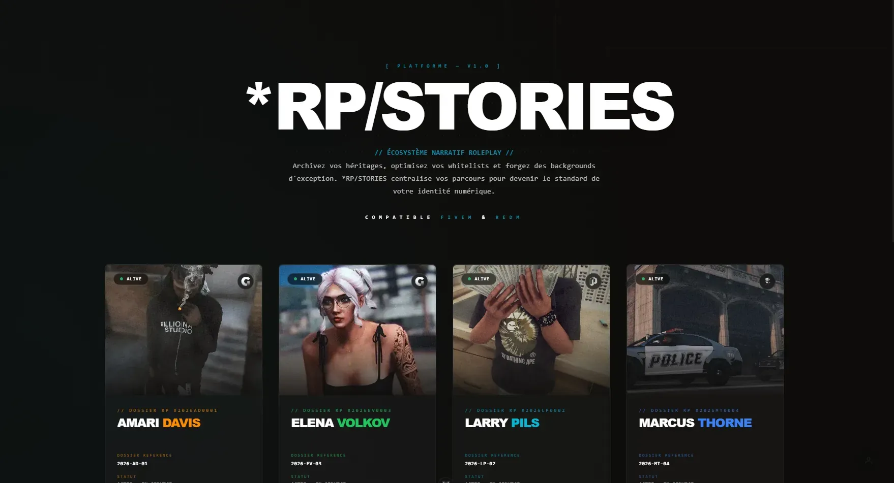

# RPStories 🏛️✨

### The Ultimate Immersive and Dynamic Character Archive for Roleplay Communities (FiveM, RedM, etc.)

[](https://vuejs.org/)
[](https://vitejs.dev/)
[](https://tailwindcss.com/)
[](https://supabase.com/)
[](https://www.gnu.org/licenses/gpl-3.0)

---

**RPStories** is a state-of-the-art web application designed to host and showcase immersive character dossiers for roleplay environments. Inspired by classified intelligence databases and futuristic heads-up displays, it blends deep narrative storytelling with modern web technologies (real-time database, authentication, dynamic forms, and granular access control).

---

## 🌟 Key Features & User Experience

### 🎭 Immersive Atmosphere & Reactive Styling
* **"Ghost Protocol" UI System**: A premium, highly aesthetic interface featuring directional motion blurs, film grain overlays, scanline grids, and smooth scanline animations.
* **Atmosphere Engine**: The website's accent colors synchronize automatically and dynamically with each character's specific color palette and primary photos.
* **Life Status Aesthetics (Alive / Dead / CK)**: Heavy visual degradation for deceased characters, featuring dense analog noise, a red classified/CK warning banner, grayscale image conversion, and a blood-red color scheme.

### 🛠️ Interactive Creation & Edition Tunnel ("Wizard")
* **Interactive Stepper**: Fluid and clickable progress indicators allowing users to jump back and forth between steps for quick edits and reviews.
* **Real-Time Step Validation**: Immediate feedback on form constraints (e.g., minimum 3 objectives per term, 4 skills per group, and between 3 and 6 cover banner photos).
* **Seamless Edition Mode**: Edit your profiles with a single click. The wizard automatically pre-loads and rehydrates form fields (converting database dates to native input formats, stripping units like `cm`/`kg` on focus to ease editing, etc.).

### 🌐 Social Network & Privacy Rules
* **Followers System**: Follow other roleplayers to build your network and stay updated on their characters' status and logs.
* **Granular Privacy Settings**: Configure who can see your character dossier:
  * **Public**: Viewable by anyone on the internet.
  * **Followers**: Restricted exclusively to users who follow you.
  * **Private**: Viewable only by you (the author).
* **Family Tree & Connections**: Visualize family ties, civil status, and character relationships dynamically using an interactive genealogy tree component.

### 🔑 Multi-Platform Auth & Toast Notifications
* **Dual Authentication Flow**: Sign up using standard email and password with secure verification links, or sign in instantly with popular OAuth providers (**Discord, Steam, Google, Cfx.re**).
* **Global Toast System**: High-end minimalist toast alerts notifying users of actions (successful login, saved character, validation errors, etc.).

---

## 🛠️ Technical Stack

* **Frontend**: Vue.js 3 (Composition API / `<script setup>`), Vite 8, Pinia (Reactive store).
* **Styling**: Tailwind CSS v4, Vanilla CSS custom properties for dynamic styling.
* **Backend & Security**: Supabase (PostgreSQL DB, GoTrue Auth session manager, Row Level Security (RLS) for server-side access control).
* **Typing & Validation**: TypeScript 6 (strict mode), Zod (schema-based data validation).

---

## 📦 Quick Start Guide

### 1. Clone the repository and install dependencies
```bash
git clone https://github.com/Elmasunder/rpstories.git
cd rpstories
npm install
```

### 2. Configure environment variables
Create a `.env.local` file at the root of the project and add your Supabase credentials:
```env
VITE_SUPABASE_URL=https://your-project.supabase.co
VITE_SUPABASE_ANON_KEY=your-anon-api-key
```

### 3. Setup the database schema
1. Go to your **Supabase Dashboard** -> **SQL Editor**.
2. Click **New Query** and paste the content of [supabase_schema.sql](file:///d:/DEV_WEB/RPStories/rpstories/supabase_schema.sql) or run the latest migrations located under `supabase/migrations/`.
3. Press **Run** to initialize all tables (`profiles`, `characters`, `follows`), automatic sign-up profile triggers, and RLS policies.

### 4. Run the application locally
* Start the development server:
  ```bash
  npm run dev
  ```
* (Optional) Seed a test character (`Valerie Reyes`) in your database:
  ```bash
  npx ts-node scripts/create-test-char.ts
  ```

---

## 🤝 Contributing & Support

All contributions are welcome! If you want to suggest design updates or add new features, please take a look at our [CONTRIBUTING.md](CONTRIBUTING.md).

If you find this project inspiring, please consider giving it a **star ⭐** on GitHub!

**Developed with passion by [Elma Sunder](https://github.com/Elmasunder)**
