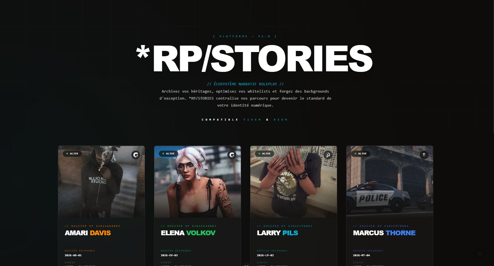

# RPStories 🏛️✨
### The Ultimate Immersive Character Archive for Roleplay Communities

[](https://vuejs.org/)
[](https://vitejs.dev/)
[](https://tailwindcss.com/)
[](https://www.gnu.org/licenses/gpl-3.0)

---

**RPStories** is a state-of-the-art web application designed to host and showcase immersive character dossiers for roleplay environments (FiveM, RedM, etc.). Built with a "story-first" philosophy, it transforms technical data into a refined, high-end visual experience inspired by top-tier classified intelligence databases.

## 🚀 Key Features

- **"Ghost Protocol" UI System**: A highly immersive, responsive interface featuring dynamic blurring, photographic noise overlays, and custom interactive scroll hints.
- **Reactive Atmosphere Engine**: A dynamic UI system built on **Tailwind CSS v4** that synchronizes the entire site's atmosphere with the character's visual identity using CSS variables.
- **Status-Aware Theming**: Automatic visual processing for **Missing** or **Deceased** characters, featuring heavy visual degradation (intense film grain), red-alert FBI-style stamps, and dramatic grayscale shifts.
- **Interactive Networking**: A built-in sleek Friend List mockup with fluid hover animations, designed for easy API integration to connect player networks.
- **Genealogy & Growth Hacking**: Centralized family trees blending lore visualization with integrated marketing prompts to expand your RP community.
- **Premium Aesthetics**: Focused on high-end typography (Outfit, JetBrains Mono), smooth transitions, custom minimalist scrollbars, and game-inspired UI elements.
- **Template-Driven Architecture**: Easily add new characters by following the standardized documentation and automated data indexing.

## 🛠️ Tech Stack

- **Framework**: Vue.js 3 (Composition API)
- **Build Tool**: Vite 8
- **Styling**: Tailwind CSS v4 (Full Utility-First)
- **Typings**: TypeScript (Strict Mode)
- **Deployment**: Optimized for GitHub Pages

## 📦 Getting Started

### Installation

1. Clone the repository:
   ```bash
   git clone https://github.com/Elmasunder/rpstories.git
   ```

2. Install dependencies:
   ```bash
   npm install
   ```

3. Run the development server:
   ```bash
   npm run dev
   ```

## 📖 Adding Characters

RPStories is designed to be easily extensible. To add a new character:

1. **Copy the Template**: Use `src/data/characters/_template.ts.example` as a starting point.
2. **Rename & Fill**: Rename it to `your_character_id.ts` and fill in the lore, skills, and photos.
3. **Automatic Indexing**: The engine automatically detects and adds the new character to the Hub.
4. **Assets**: Place images in `public/assets/your_character_id/`.

---

## 🤝 Contributing

We believe every story matters! Whether you want to improve the UI, add a new feature, or fix a bug, all contributions are welcome. See our [CONTRIBUTING.md](CONTRIBUTING.md) for more details.

## ⭐ Support

If you find this project useful or inspiring, please consider giving it a **star** on GitHub!

**Developed by [Elma Sunder](https://github.com/Elmasunder)**
