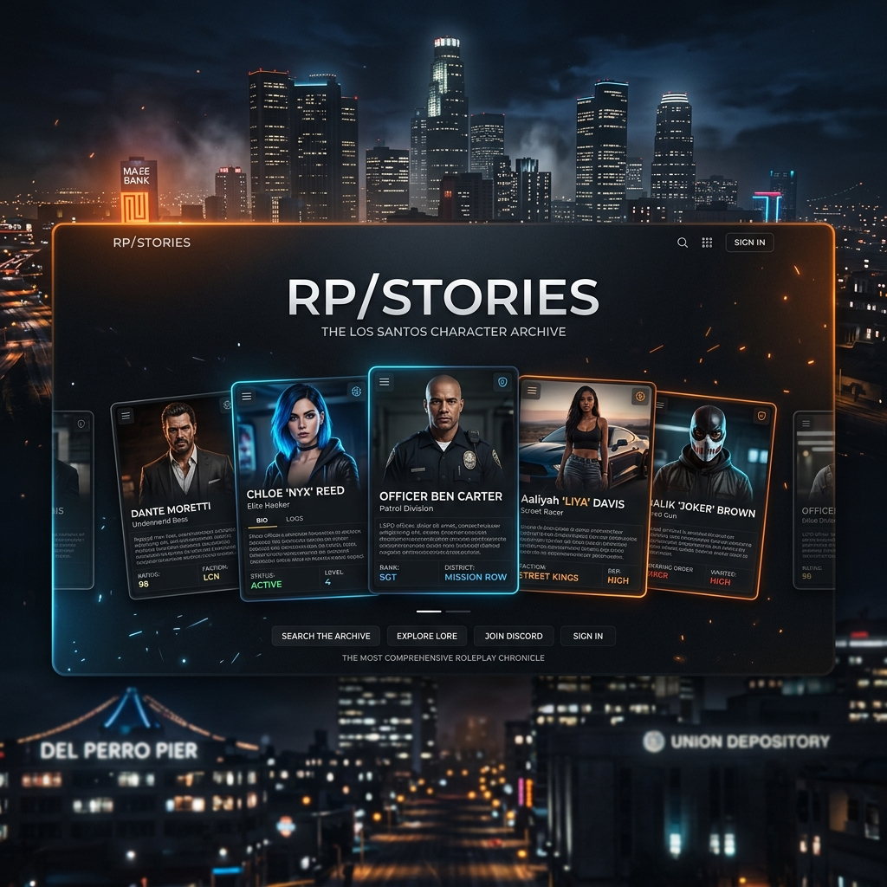

# 🎭 RPStories — Immersive Character Archive



> **"Parce que chaque personnage mérite une archive à la hauteur de sa légende."**

RPStories est une plateforme de narration immersive conçue pour centraliser et sublimer les dossiers de personnages de Roleplay (FiveM, RedM, etc.). Oubliez les fiches techniques froides : ici, chaque dossier est une expérience visuelle et atmosphérique.

---

## ✨ Points Forts (Features)

*   **🌈 Ambient Glow System** : L'interface s'adapte dynamiquement à l'identité visuelle de chaque personnage grâce à un système de lueur interactive.
*   **💀 Status-Aware Design** : Un thème visuel distinctif pour les personnages décédés (CK), rendant hommage à leur histoire passée.
*   **📱 Architecture Modulaire** : Construit avec **Vue.js 3** et **Vite**, le projet est ultra-rapide et facile à faire évoluer.
*   **🎨 Design Premium** : Typographies soignées, effets de grain, et mise en page inspirée des interfaces de jeux AAA.

---

## 🛠️ Stack Technique


---

## 🚀 Installation & Lancement

Si vous souhaitez héberger votre propre archive :

1. **Cloner le dépôt**
   ```bash
   git clone https://github.com/Elmasunder/rpstories.git
   ```

2. **Installer les dépendances**
   ```bash
   npm install
   ```

3. **Lancer en local**
   ```bash
   npm run dev
   ```

---

## 📖 Comment ajouter un personnage ?

C'est très simple ! Tout se passe dans un seul fichier de données :

1. Ouvrez `src/data/characters.js`.
2. Ajoutez un nouvel objet dans `characters` en suivant le modèle existant.
3. Déposez vos images dans `public/assets/votre_nom/`.
4. Le site générera automatiquement les couleurs d'ambiance et la page dédiée.

---

## ⭐ Crédits & Support

Ce projet a été réalisé avec passion pour la communauté Roleplay. Si le concept vous plaît, n'hésitez pas à **laisser une petite étoile ⭐** sur ce dépôt, ça fait toujours plaisir et ça aide à faire connaître le projet !

**Développé par [Elma Sunder](https://github.com/Elmasunder)**
